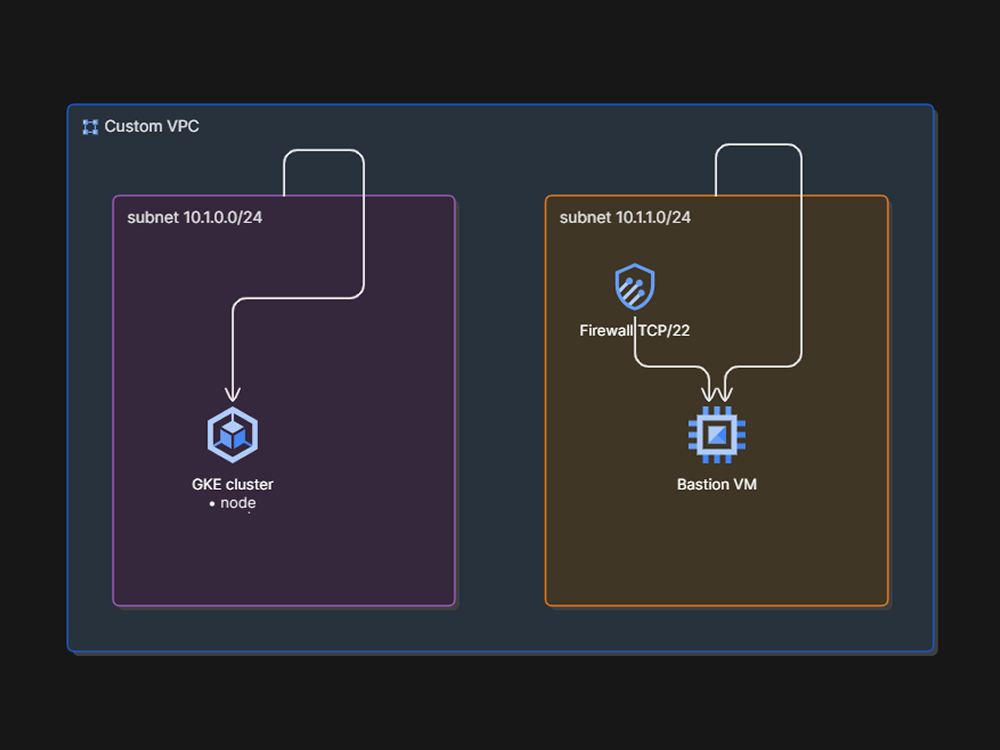

# GCP Base Infrastructure (Terraform)

Modular **Terraform** layout for core **Google Cloud** networking.

# Design Architecture Diagram

## What this demonstrates

- **IaC** with reusable modules and remote state (GCS backend, lockfile).
- **Networking**: Custom VPC (no default subnets), dedicated subnets for the cluster (`10.1.0.0/24`) and bastion (`10.1.1.0/24`).
- **Compute**: Debian 13 bastion on `e2-micro` with network tags and a targeted SSH firewall rule.
- **Kubernetes**: GKE cluster in a pinned zone (`${var.region}-a`), default node pool removed in favor of a custom `e2-micro` node pool.

## Tech stack

| Area          | Choice                                   |
| ------------- | ---------------------------------------- |
| IaC           | Terraform, GCP provider                  |
| State         | GCS backend + lockfile                   |
| Region        | Configurable (default `asia-southeast1`) |
| Orchestration | Google Kubernetes Engine (GKE)           |

## Repository layout

| Path                          | Role                                                    |
| ----------------------------- | ------------------------------------------------------- |
| `main.tf`                     | Root module: wires VPC, subnets, bastion, firewall, GKE |
| `modules/compute_network`     | VPC                                                     |
| `modules/compute_subnetwork`  | Subnet (reused for cluster and bastion)                 |
| `modules/compute_instance`    | Compute Engine VM (bastion)                             |
| `modules/compute_firewall`    | VPC firewall rules                                      |
| `modules/container_cluster`   | GKE cluster                                             |
| `modules/container_node_pool` | GKE node pool                                           |

## Prerequisites

- [Terraform](https://developer.hashicorp.com/terraform/install) **1.x** (compatible with your lockfile).
- [Google Cloud SDK](https://cloud.google.com/sdk/docs/install) (`gcloud`) with a user or SA that can create the resources above.
- A **GCS bucket** (and IAM) for the backend defined in `main.tf`.

## Implementation timeline (portfolio build log)

| Date       | Delivered                                                         |
| ---------- | ----------------------------------------------------------------- |
| 2026-05-07 | GCP account setup                                                 |
| 2026-05-08 | Remote state backend; network, subnet, instance, firewall modules |
| 2026-05-09 | GKE cluster and node pool modules                                 |
| 2026-05-13 | Update readme.md                                                  |

## Troubleshooting (local dev)

- **Application Default Credentials** — If Terraform reports no credentials, run `gcloud auth application-default login` and ensure `GOOGLE_APPLICATION_CREDENTIALS` is unset or points to the intended JSON key when using a key file.
- **Long or stuck `terraform apply` on GKE** — Keep the cluster **location** explicit (this repo uses `"${var.region}-a"`). Vague or mismatched region/zone settings can make cluster operations appear to hang.
